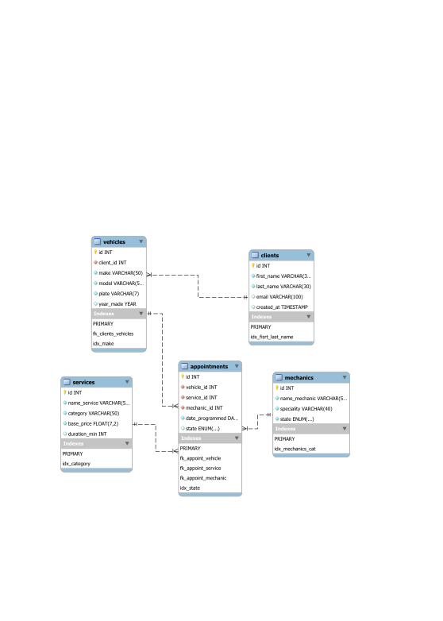

# 🏎️ Garaje Élite Campus (EGC) 🚙

> **Garaje Élite Campus** es una solución relacional de base de datos en MySQL diseñada para gestionar las operaciones fundamentales de un taller automotriz, administrando clientes, vehículos, catálogo de servicios, mecánicos y el agendamiento de citas de reparación.

---

## 📝 Descripción General

El sistema permite estructurar y mantener la integridad de los datos operativos de un taller mecánico mediante relaciones relacionales bien definidas, validaciones defensivas mediante procedimientos almacenados y un modelo de datos optimizado para consultas de alto volumen.

---

## 📄 Requerimientos

El proyecto cuenta con un análisis detallado de requerimientos funcionales y reglas de negocio para cada una de las entidades del sistema (`clientes`, `vehículos`, `servicios`, `mecánicos` y `citas`).

Para consultar la documentación completa de requerimientos y reglas del taller, visita:
👉 **[Análisis de Requerimientos](analysis/requiremets.md)**

---

## 📐 Modelo Entidad-Relación (MER)

El diseño y las relaciones de la base de datos se encuentran representados visualmente en el diagrama del proyecto:



> *También puedes consultar la versión en formato de imagen en [drawSQL](diagrams/drawSQL_EGC_MER.webp).*

---

## 🛠️ Tecnologías Aplicadas

* **MySQL Server 8.0+**: Sistema Gestor de Bases de Datos Relacionales (SGBD) utilizando el motor InnoDB para transacciones ACID.
* **SQL (DDL / DML / Stored Procedures)**: Definición del esquema, script de datos semilla y procedimientos almacenados con control de errores (`SIGNAL SQLSTATE '45000'`).
* **MySQL Workbench / drawSQL**: Herramientas de diseño y diagramación del Modelo Entidad-Relación.
* **Git & GitHub**: Control de versiones distribuido.

---

## 📁 Estructura del Repositorio

```text
elite-garage-campus/
├── analysis/
│   └── requiremets.md        # Especificación de requerimientos funcionales
├── diagrams/
│   ├── Wrb_EGC_MER.svg       # Diagrama MER exportado desde Workbench
│   └── drawSQL_EGC_MER.webp  # Diagrama MER exportado desde drawSQL
├── src/
│   ├── ddl/
│   │   └── schema.sql        # Creación de tablas, FKs e índices
│   ├── dml/
│   │   └── insert.sql        # Registros semilla iniciales
│   └── crud/
│       └── query.sql         # Stored Procedures para operaciones CRUD
└── README.md                 # Documentación del proyecto
```

---

## ⚡ Procedimientos Almacenados

El sistema expone la lógica de negocio a través de procedimientos almacenados que gestionan las operaciones CRUD de forma segura:

* **Clientes**: `sp_create_client`, `sp_update_client`, `sp_select_client`, `sp_delete_client`
* **Vehículos**: `sp_create_vehicle`, `sp_update_vehicle`, `sp_select_vehicle`, `sp_delete_vehicle`
* **Servicios**: `sp_create_service`, `sp_update_service`, `sp_select_service`, `sp_delete_service`
* **Mecánicos**: `sp_create_mechanic`, `sp_update_mechanic`, `sp_select_mechanic`, `sp_delete_mechanic`
* **Citas**: `sp_create_appointment`, `sp_update_appointment`, `sp_select_appointment`, `sp_delete_appointment`

## 👨‍💻 Autor

* **Anderson-Oloroso** 

### **Última modificación:**_17/08/2026_